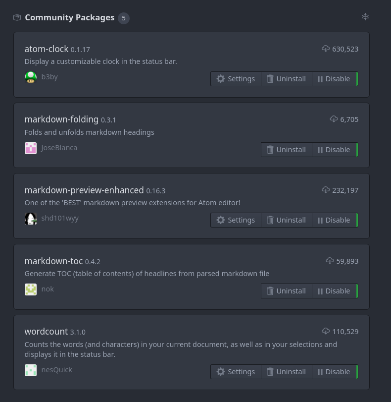

# Gen1e's Dotfiles

Various customization files, form bash to vim to Atom configs.

## Vim

The vimrc has everything, the pulgins are managed by vim-plug, which is setup to auto update.

## Atom

No easy way to sync/export settings so I have a screenshot of the current community packages I use and some notes.

### Packages Settings

#### Word Count

- Make sure to turn on reading time

#### Markdown Preview

- Set Preview theme and code style theme to OneDark to match the editor

### General Settings

- Set tabs to display as 4 spaces
- Setup softabs and set to 4

